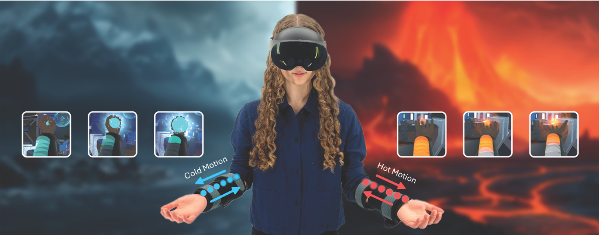

# Thermal In Motion: Designing Thermal Flow Illusions with Tactile and Thermal Interaction

[](./Documentation/UIST24_ThermalMotion.pdf)
[](https://www.youtube.com/watch?v=n2H_ylyzcbY)
[](https://uist.acm.org/2024/)

---

## Project Description

The paper addresses the emerging use of **thermal feedback** in VR and notes that, while temperature cues can greatly increase immersion and realism, current thermal interfaces struggle with localized thermal control and dynamic spatial patterns such as flowing or animated heat and cold. Existing systems typically cannot make users feel temperature moving along specific body regions or forming continuous animations, which limits the expressiveness of thermal feedback compared to visual and auditory channels. To overcome these limitations, the authors introduce **thermal motion**, an illusion of flowing thermal sensation created by combining thermal referral with tactile motion illusions on the forearm. By strategically activating a small number of thermal and vibrotactile actuators placed near each other, they continuously generate thermal referral illusions at successive tactile locations, so that users perceive thermal cues moving along the skin without physically moving the thermal source. This perception-based approach promises more nuanced and scalable thermal feedback for VR, reducing hardware requirements while enabling precise, dynamic thermal animations. 

---

## Contributions

1. **Novel perception-based approach for moving thermal cues**  
   Introduced **thermal motion** as a new method to induce the perception of moving thermal sensations by integrating thermal referral with tactile motion illusions, allowing thermal cues to appear as if they flow across the skin. 

2. **Adaptation of tactile motion methods into a scalable thermal motion algorithm**  
   Building on existing tactile motion techniques such as Tactile Brush, they adapt timing and intensity control strategies to coordinate one thermal actuator with multiple tactile actuators, yielding a scalable algorithm for generating continuous thermal motion with few thermal elements.
   
3. **Definition of key parameters for optimal thermal motion**  
   Through three forearm experiments, the paper establishes critical parameters for effective thermal motion, including optimal thermal actuator placement, temperature conditions, and detectable speed ranges for hot and cold motion, and validates the approach in VR interaction scenarios. 




---

## 📁 Repository Structure

* **[Documentation/](./Documentation)** — Full research paper (PDF) and technical specifications.

---

## 🛠️ Bill of Materials (BOM)
The following components were used to build the [Project Name] prototype:

| Category | Item | Purpose |
| :--- | :--- | :--- |
| **Haptic Actuator** | Tatoko B07Q1ZV4MJ | Haptic feedback on forearm |
| **Peltier** | FTED S043A030040 | Thermal output generation |

---

## 📄 Citing
If you use this work or the hardware design in your research, please cite our paper:

```bibtex
@inproceedings{10.1145/3654777.3676460,
author = {Singhal, Yatharth and Honrales, Daniel and Wang, Haokun and Kim, Jin Ryong},
title = {Thermal In Motion: Designing Thermal Flow Illusions with Tactile and Thermal Interaction},
year = {2024},
isbn = {9798400706288},
publisher = {Association for Computing Machinery},
address = {New York, NY, USA},
url = {https://doi.org/10.1145/3654777.3676460},
doi = {10.1145/3654777.3676460},
booktitle = {Proceedings of the 37th Annual ACM Symposium on User Interface Software and Technology},
articleno = {27},
numpages = {13},
keywords = {Haptics, Thermal Feedback, Thermal Masking, Thermal Motion, Thermal Referral, VR, Vibration-induced Thermal Illusions},
location = {Pittsburgh, PA, USA},
series = {UIST '24}
}
